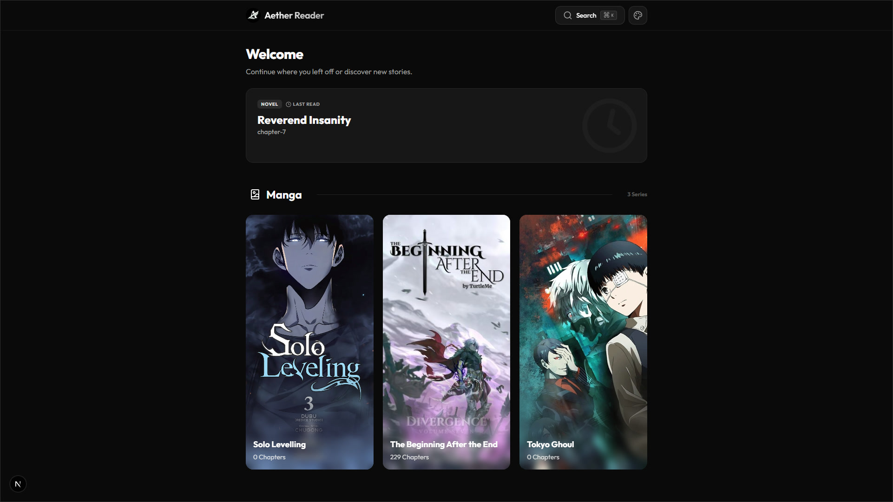
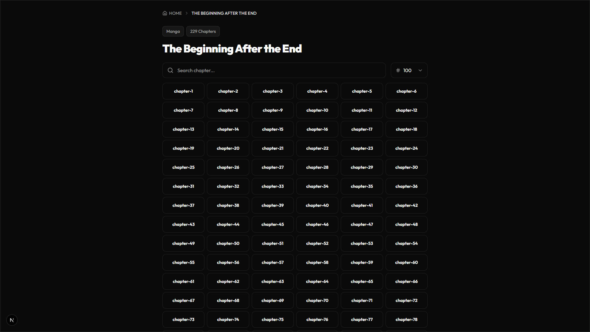

<div align="center">
  
  <br />
  <br />

  [](https://nextjs.org/)
  [](https://react.dev/)
  [](https://www.typescriptlang.org/)
  [](https://tailwindcss.com/)
  [](https://www.radix-ui.com/)

  <p align="center">
    <b>A Modern, Fast, and Elegant Digital Reading Experience</b>
    <br />
    <br />
    <a href="#about">About</a> •
    <a href="#features">Features</a> •
    <a href="#tech">Technologies</a> •
    <a href="#setup">Setup</a>
  </p>
</div>

---

## 📋 <a id="about"></a> About

**Aether Reader** is a premium digital library and reading application developed with modern web technologies, bringing both mangas and novels under one roof.

Designed to elevate your reading experience with its user-friendly interface, advanced theme system, and smooth animations. All content is managed locally and served to you at maximum speed.



## ✨ <a id="features"></a> Features

### 📚 Smart Library Management
- **Local File System**: Creates a library by analyzing the files you add from their folder names, without needing any database.
- **Automatic Categorization**: Automatically categorizes manga and novel content and presents them in the appropriate reader mode.
- **Slider Experience**: Navigate quickly and smoothly between series with Embla Carousel support.
- **Continue Where You Left Off**: Return instantly to the last series and chapter you read with the "Continue" button.

### 🔍 Advanced Navigation
- **Global Search**: A modern search modal that allows you to reach any series instantly.
- **Fast Chapter Transitions**: Smooth navigation between chapters and direct access capabilities.
- **Responsive Design**: A seamless experience from PC to tablet, and tablet to phone.



## 🛠️ <a id="tech"></a> Technologies

The project is built using today's fastest and most reliable modern web technologies:

### Frontend & Framework
- **[Next.js 16+](https://nextjs.org/)**
- **[React 19](https://react.dev/)**
- **[Tailwind CSS v4](https://tailwindcss.com/)**
- **[Lucide React](https://lucide.dev/)**

### UI & Experience
- **[Embla Carousel](https://www.embla-carousel.com/)**
- **[Next Themes](https://github.com/pacocoursey/next-themes)**
- **[Radix UI](https://www.radix-ui.com/)**


## 🚀 <a id="setup"></a> Setup and Development

You can follow the steps below to run the project in your local environment.

### Prerequisites
- **Node.js** (v18+)
- **NPM** or **Bun**

### Installation Steps

1.  **Clone the Repository**
    ```bash
    git clone https://github.com/xkintaro/aether-reader.git
    cd aether-reader
    ```

2.  **Install Dependencies**
    ```bash
    npm install
    ```

3.  **Start the Development Server**
    ```bash
    npm run dev
    ```

4. Access the application by going to `http://localhost:3000` in your browser.

## ⚙️ How the System Works? (`/contents` Folder)

Aether Reader works entirely on a local file system logic and does not require complex database setups. Simply structure the `contents/` folder correctly to create your library:

### For Reading Manga
Add your files to the `contents/manga/` directory. Aether Reader reads the nested folder structure:
1. The main folder name is taken as the **Series Title**. (e.g., `contents/manga/Tokyo Ghoul/`)
2. Subfolders are processed as **Chapters**. (e.g., `contents/manga/Tokyo Ghoul/chapter-1/`)
3. All popular image formats (`.jpg`, `.png`, `.webp`, etc.) inside the chapter folder are displayed in order.

### For Reading Novels
Add your files to the `contents/novel/` directory.
1. The main folder name is taken as the **Series Title**. (e.g., `contents/novel/Solo Leveling/`)
2. `.txt` files inside the folder are automatically detected as **Chapters**. (e.g., `contents/novel/Solo Leveling/chapter-1.txt`)

> **Adding a Cover Image:** The first image file (e.g., `cover.jpg`) you add to the main folder of any series (whether manga or novel) is automatically used as the cover image for that series. Otherwise, a default cover is assigned.

---

<p align="center">
  <sub>❤️ Developed by Kintaro.</sub>
</p>
